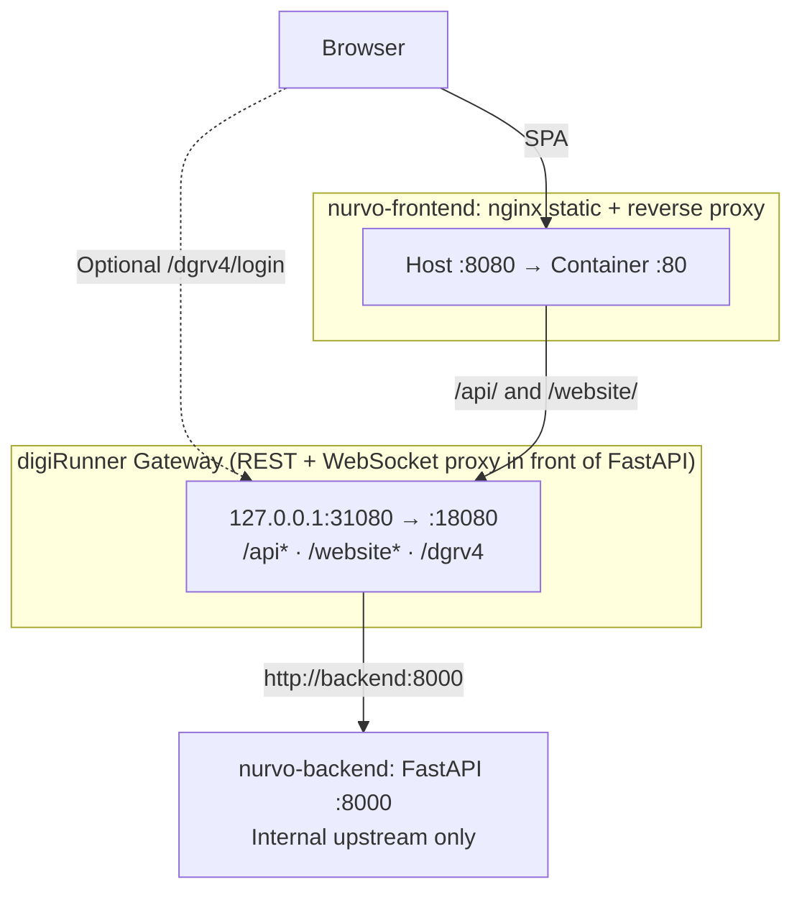

# Nurvo

English | [中文](README.zh.md)

Nursing Communication Simulation Game — MVP. Trainees practice clinical communication by speaking with AI-simulated patients and family members, then receive an LLM-graded scorecard.

## Architecture

Main flow: **Browser → Frontend nginx → digiRunner (gateway in front of FastAPI) → FastAPI**. Both game traffic (`/api`) and real-time messaging (`/website`) pass through digiRunner before reaching the backend. **Admin** can connect directly to digiRunner at `127.0.0.1:31080`.



* **Frontend:** Vue.js 3, Vite, TypeScript
* **Backend:** FastAPI (Python)
* **API Gateway:** [digiRunner Open Source](https://github.com/TPIsoftwareOSPO/digiRunner-Open-Source) — proxies `/api/*` and WebSocket; exposed only at `127.0.0.1:31080` → internal `18080`
* **Voice:** ElevenLabs TTS, ElevenLabs Scribe (speech-to-text)
* **AI:** OpenAI GPT-4o (scenario generation & scoring), gpt-4.1-mini (conversation, configurable), DALL·E 3 (ward background image, generated asynchronously)
* **Database:** Supabase (planned); digiRunner ships with H2 (file-based, stores proxy/site config)

## Quick Start (Docker)

Make sure Docker and Docker Compose are installed.

1. Create a `.env` file inside `nurvobackend/` (refer to `.env.example`):

   ```env
   OPENAI_API_KEY=your_openai_api_key
   OPENAI_CONVERSATION_MODEL=gpt-4.1-mini
   ELEVENLABS_API_KEY=your_elevenlabs_api_key
   ELEVENLABS_TTS_MODEL=eleven_flash_v2_5
   ELEVENLABS_PATIENT_VOICE_ID=...
   ELEVENLABS_FAMILY_VOICE_ID=...
   # Optional: per-role / per-gender voice IDs; family_0/1/2 map to the three family members
   ELEVENLABS_PATIENT_MALE_VOICE_ID=...
   ELEVENLABS_PATIENT_FEMALE_VOICE_ID=...
   ELEVENLABS_FAMILY_0_MALE_VOICE_ID=...
   ELEVENLABS_FAMILY_0_FEMALE_VOICE_ID=...
   ELEVENLABS_FAMILY_1_MALE_VOICE_ID=...
   ELEVENLABS_FAMILY_1_FEMALE_VOICE_ID=...
   ELEVENLABS_FAMILY_2_MALE_VOICE_ID=...
   ELEVENLABS_FAMILY_2_FEMALE_VOICE_ID=...
   ```

   Optional proactive-speech settings (defaults work out of the box):

   ```env
   PROACTIVE_ENABLED=true
   PROACTIVE_IDLE_THRESHOLDS=25,20,15
   PROACTIVE_COOLDOWN_SECONDS=10
   PROACTIVE_ENDGAME_GUARD_SECONDS=30
   RECONNECT_GRACE_SECONDS=10
   ```

   Optional: create a `.env` at the project root (same level as `infra/`) and set `DIGIRUNNER_DB_PASSWORD` (H2 database password; leave empty to match the original default).

2. Build and start all services from the project root:

   ```bash
   docker compose -f infra/docker-compose.yml build --no-cache && docker compose -f infra/docker-compose.yml up --force-recreate
   ```

3. Once running:
   * Frontend: [http://localhost:8080](http://localhost:8080)
   * API Gateway (all `/api/*` traffic): [http://localhost:31080](http://localhost:31080)
   * digiRunner Admin Console: [http://localhost:31080/dgrv4/login](http://localhost:31080/dgrv4/login)

   > **First-time setup (Admin Console)**
   > - **REST API Proxy**: path prefix `/api`, upstream `http://backend:8000`.
   > - **WebSocket Proxy**: site name must match the frontend config (default `nurvo-chat`), target `ws://backend:8000/api/chat/ws` (digiRunner rewrites it to a fixed path; the browser connects via `ws://<host>:<port>/website/nurvo-chat`).
   > Default credentials: `manager / manager123` — **change before any public deployment**.
   > The local `docker compose` binds digiRunner to `127.0.0.1:31080` only, reducing LAN exposure risk.
   > The production **nginx** routes `/api/` and `/website/` to digiRunner; port `8000` is internal-only and should not be exposed directly.

To stop all services:

```bash
docker compose -f ./infra/docker-compose.yml down
```

## Game & API Behaviour (Summary)

* **Scenario difficulty**: `POST /api/scenario/generate` accepts `{"difficulty":"easy"|"medium"|"hard"}`; the server overrides the session time limit accordingly (e.g. easy 600 / medium 480 / hard 360 seconds — see `TIME_LIMIT_BY_DIFFICULTY` in the backend for the authoritative values).
* **Background image**: DALL·E generates the ward image **asynchronously** after the scenario is created. The frontend polls `GET /api/scenario/{session_id}/background` and displays the URL once ready.
* **Real-time chat WebSocket (via digiRunner)**: after connecting to `/website/{site-name}`, the **first message** must be `{"type":"session_join","session_id":"..."}`, followed by `nurse_message` and other message types on the same route. The site name is configured via `VITE_DIGIRUNNER_WS_SITE` in `nurvofronted/.env.development` and must match the digiRunner admin setting (default `nurvo-chat`).
* **Optional direct connection (debug)**: if the gateway is not needed, connect directly to `ws://.../api/chat/{session_id}` — the backend supports both the fixed path and the path-parameterised form.

## Local Development (without Docker)

> **Note**: Vite proxies `/api` and `/website` (including WebSocket) to `http://localhost:31080`. You need a local digiRunner on port 31080 (common approach: start only the `digirunner` + `backend` services via the same `docker compose`), or temporarily edit `nurvofronted/vite.config.ts` to point `/api` and the WebSocket directly at `http://localhost:8000`.

### Backend (FastAPI)

```bash
cd nurvobackend
pip install -r requirements.txt
uvicorn main:app --reload
```

### Frontend (Vite)

```bash
cd nurvofronted
npm install
npm run dev
```

## UI Reference

[Canva Link](https://www.canva.com/design/DAHEF8M_KoU/_A96ERatW-9VF8yBo8md1Q/edit?utm_content=DAHEF8M_KoU&utm_campaign=designshare&utm_medium=link2&utm_source=sharebutton)
