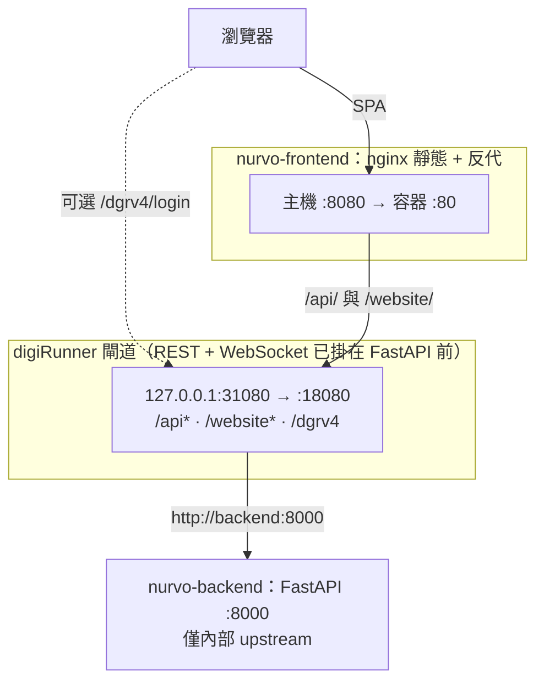

# Nurvo

護理溝通情境遊戲 MVP。透過語音互動與 AI 扮演的病患、家屬進行對話，訓練護理人員的溝通技巧。

## 系統架構

主流程：**瀏覽器 → 前端 nginx → digiRunner（前段已接在 FastAPI 前）→ FastAPI**。遊戲用 `/api`、即時通訊 `/website` 都經由 digiRunner 再轉到後端；**Admin** 可從瀏覽器直連 `127.0.0.1:31080` 的 digiRunner。



* **前端 (Frontend):** Vue.js 3, Vite, TypeScript
* **後端 (Backend):** FastAPI (Python)
* **API Gateway:** [digiRunner Open Source](https://github.com/TPIsoftwareOSPO/digiRunner-Open-Source)（代管 `/api/*` 與 WebSocket Proxy；容器對外僅 `127.0.0.1:31080` → 內部 `18080`）
* **語音 (Voice):** ElevenLabs TTS、ElevenLabs Scribe（語音轉文字）
* **人工智慧 (AI):** OpenAI GPT-4o（情境與評分）、gpt-4.1-mini（對話預設，可調整）、DALL·E 3（病房背景圖，非同步產生）
* **資料庫 (Database):** Supabase（規劃中）；digiRunner 內建 H2（檔案式，存 proxy／站台設定）

## 快速啟動 (Docker)

本專案已支援 Docker 容器化部署。請確認您的環境已安裝 Docker 與 Docker Compose。

1. 在 `nurvobackend` 資料夾中建立 `.env` 檔案，並填寫必要的 API 金鑰（可參考 `.env.example`）：
   ```env
   OPENAI_API_KEY=your_openai_api_key
   OPENAI_CONVERSATION_MODEL=gpt-4.1-mini
   ELEVENLABS_API_KEY=your_elevenlabs_api_key
   ELEVENLABS_TTS_MODEL=eleven_flash_v2_5
   ELEVENLABS_PATIENT_VOICE_ID=...
   ELEVENLABS_FAMILY_VOICE_ID=...
   # 可選：依角色與性別指定不同聲線；family_0/1/2 分別對應三位家屬
   ELEVENLABS_PATIENT_MALE_VOICE_ID=...
   ELEVENLABS_PATIENT_FEMALE_VOICE_ID=...
   ELEVENLABS_FAMILY_0_MALE_VOICE_ID=...
   ELEVENLABS_FAMILY_0_FEMALE_VOICE_ID=...
   ELEVENLABS_FAMILY_1_MALE_VOICE_ID=...
   ELEVENLABS_FAMILY_1_FEMALE_VOICE_ID=...
   ELEVENLABS_FAMILY_2_MALE_VOICE_ID=...
   ELEVENLABS_FAMILY_2_FEMALE_VOICE_ID=...
   ```
   可選：在專案根目錄或與 `infra` 同層建立 `.env`，設定 `DIGIRUNNER_DB_PASSWORD`（H2 資料庫密碼；未設則為空，行為同舊版）。

2. 於專案根目錄執行以下指令啟動所有服務：
   ```bash
   docker compose -f infra/docker-compose.yml build --no-cache && docker compose -f infra/docker-compose.yml up --force-recreate
   ```

3. 服務啟動後：
   * 前端網頁：[http://localhost:8080](http://localhost:8080)
   * API Gateway（所有 `/api/*` 流量）：[http://localhost:31080](http://localhost:31080)
   * digiRunner Admin Console：[http://localhost:31080/dgrv4/login](http://localhost:31080/dgrv4/login)

   > **首次啟動（Admin Console）**  
   > - **REST API Proxy**：路徑前綴 `/api`，upstream `http://backend:8000`。  
   > - **WebSocket Proxy**：站點名稱與前端一致（預設 `nurvo-chat`），目標 `ws://backend:8000/api/chat/ws`（digiRunner 轉成固定路徑 `/api/chat/ws`，瀏覽器改連 `ws://<主機>:<埠>/website/nurvo-chat`）。  
   > 預設帳密 `manager / manager123`，**對外部署前務必修改**。  
   > 本機 `docker compose` 已將 digiRunner 僅綁在 `127.0.0.1:31080`，降低在區網上意外暴露的風險。  
   > 生產用前端 **nginx** 已將 `/api/`、`/website/` 轉到 digiRunner；`8000` 僅供容器內部 upstream，勿對外直連。

如果需要停止服務，請執行：
```bash
docker compose -f ./infra/docker-compose.yml down
```

## 遊戲與 API 行為（摘要）

* **情境難度**：`POST /api/scenario/generate` 可帶 `{"difficulty":"easy"|"medium"|"hard"}`；伺服器依難度覆寫每局秒數（例如 easy 600／medium 480／hard 360，實際以後端 `TIME_LIMIT_BY_DIFFICULTY` 為準）。
* **背景圖**：DALL·E 在產生情境後**背景非同步**產圖；前端以 `GET /api/scenario/{session_id}/background` 輪詢，就緒後再顯示 URL。
* **即時聊天 WebSocket（經 digiRunner）**：連上 `/website/{站點名稱}` 後，**第一則訊息**須為 `{"type":"session_join","session_id":"..."}`，之後同一路由傳 `nurse_message` 等。站點名稱可透過 `nurvofronted/.env.development` 的 `VITE_DIGIRUNNER_WS_SITE` 與 digiRunner 後台一致（預設 `nurvo-chat`）。
* **可選直連除錯**：若不需 gateway，可改連 `ws://.../api/chat/{session_id}`（後端同時提供固定路徑與路徑內帶 `session_id` 兩種方式）。

## 本地開發啟動 (無 Docker)

> **注意**：Vite 已設定 `/api` → `http://localhost:31080`、`/website` → `http://localhost:31080`（含 WebSocket）。本機需有 **digiRunner** 在 31080（常見做法：用同一套 `docker compose` 只起 `digirunner`＋`backend`），或暫改 `nurvofronted/vite.config.ts` 讓 `/api` 與（若用）直連 WebSocket 改打 `http://localhost:8000`。

### 後端 (FastAPI)
```bash
cd nurvobackend
pip install -r requirements.txt
uvicorn main:app --reload
```

### 前端 (Vite)
```bash
cd nurvofronted
npm install
npm run dev
```

## UI 參考
[Canva Link](https://www.canva.com/design/DAHEF8M_KoU/_A96ERatW-9VF8yBo8md1Q/edit?utm_content=DAHEF8M_KoU&utm_campaign=designshare&utm_medium=link2&utm_source=sharebutton)
